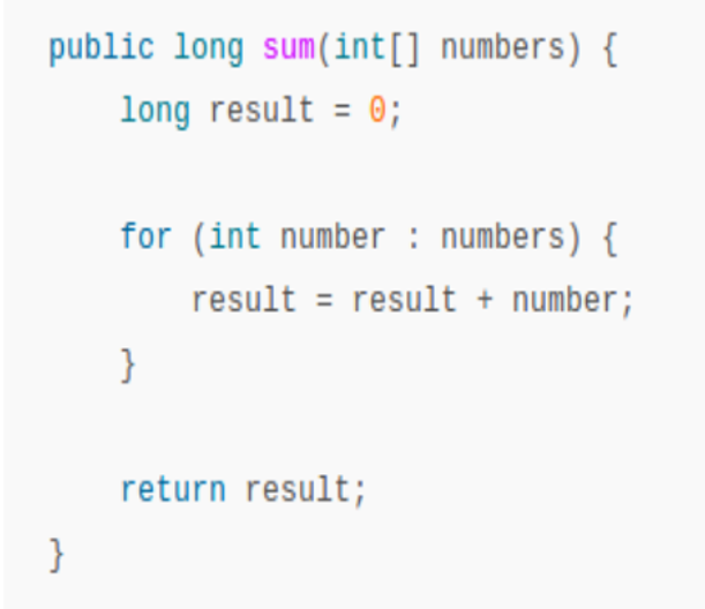
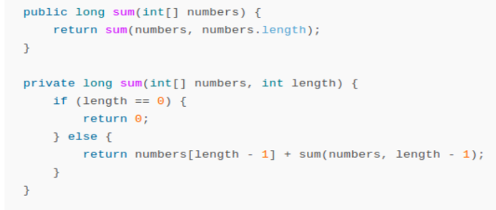

# 1. dqedknwekfnwekjComplejidad esencial y complejidad accidental

Todo problema a resolver conlleva una cierta complejidad,  en este caso se definirá complejidad esencial y complejidad accidental.

"No silver bullet" es un ensayo en el cual se aborda “Esencia y accidente de la Ingeniería de Software” escrito por Fred Books en 1986.

__¿Que es la complejidad esencial?__

Es aquella complejidad que va inherente al problema.

Para comprender el término se mencionan los siguientes ejemplos:

* Levantamiento de requerimientos con el cliente.
* Desarrollar software.

__¿Que es la complejidad accidental?__

Es aquella complejidad que le añadimos nosotros mismos en el transcurso de la resolución del problema.
 
Para comprender el término se mencionan los siguientes ejemplos a lo cuales se le añade complejidad a los problemas:

* Reunión improductiva para el levantamiento de requerimientos, no se definieron correctamente los requerimientos.
* El programador Senior invierte tiempo desarrollando las CSS (hojas de estilo) desde cero.
* Configuración de las herramientas que vayamos a utilizar para el desarrollo del sistema.
* Codificar métodos o funciones difícil de entender por terceros, o difíciles de mantener. Ejemplo: Implementar un método que sume los números de un arreglo de enteros, devolviendo el resultado:

__Ejercicio:__ Para el desarrollo de la actividad se realizan los siguientes pasos:

1. A cada participante del curso se le asignan 2 post-its de color diferente.
2. En un post-it el participante escribirá algo que depende en él durante el desarrollo de un proyecto.
3. En el Segundo post-it escribirá cosas que no dependen de él durante un proyecto.
4. Divida una cartulina con una línea horizontal.
5. Cada uno de los participantes pasa a leer su post-it de cosas que dependen de él y la colocara en la parte superior de la cartulina.
6. Y en la parte inferior de la cartulina pondrá el segundo post-it con cosas que no dependen de él.
7. La cartulina con los post-its se quedará colocada en el mismo lugar durante todo el curso. Se retoma para el ultimo dia de curso.

