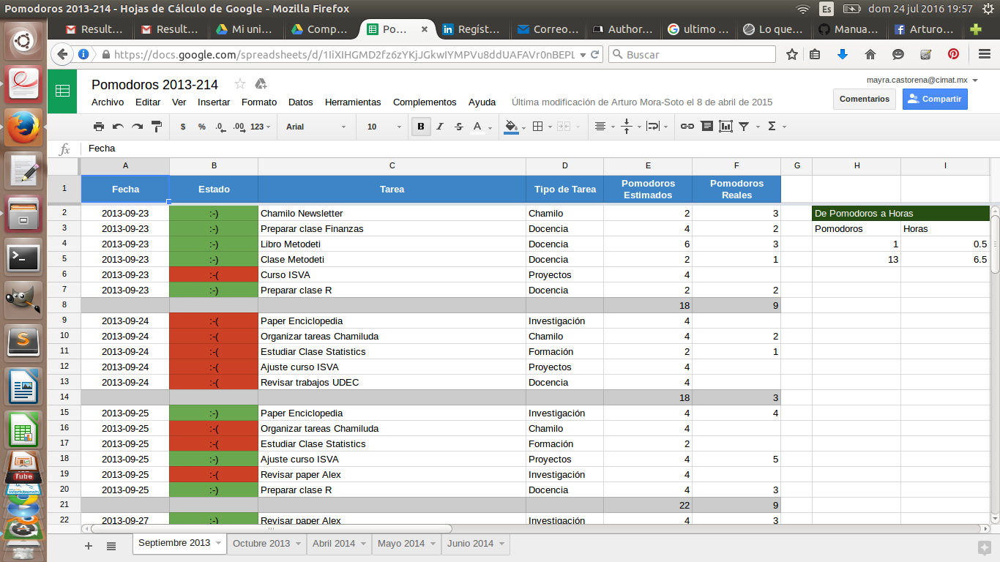

# 10. Administracion del tiempo

A muchas personas les es difícil organizar las actividades que deben realizar en el trabajo en el transucso del día. Saber administrar su tiempo es importante para aumentar la productividad del desarrollo de su trabajo, se trata de aprovechar el tiempo e invertirlo en terminar tareas que son importantes día con día.

Esta administración no es una tarea sencilla, por lo cual existen herramientas que ayudan a manejar este conflicto en el que se pueden encontrar la mayoria de las personas en la actualidad.

## 10.1 Técnica de Pomodoro

Esta técnica fue creada por Francesco Cirillo en la decada de los 80's, la cual es una de las más populares en la actualidad.

__¿En que consiste esta tecnica?__

Consiste en administrar el tiempo para conseguir obtener mayor productividad en las actividades, para ello tomamos un __pomodoro:__ que se refiere a 25 minutos aplicados a una actividad, evitando cualquier otra distracción como el celular, el telefono, la televisión, mensajes, utilización de páginas de ocio,  y cualquier cosa que pudiera interrumpir esos 25 minutos, cuando se termine el "pomodoro" se puede tomar un descanso de 5 minutos, en los cuales se puede ir al baño, contestar mensajes, checar el celular, facebook, tomar un café, o realizar cualquier cosa que nos haga despejar la mente del trabajo o la actividad que se realizo durante el "pomodoro", finalizados los 5 minutos de descanso, se puede continuar con el siguiente pomodoro ya sea para terminar la misma actividad o para comenzar una nueva.

Es necesario antes de comenzar la actividad, hacer una estimación del tiempo que tomara realizar una actividad, y dividirla en pomodoros. Para tener un conocimiento previo de cuanto tiempo llevara realizar una tarea, y cuantas tareas se alcanzaran a teminar durante las 8 horas de trabajo o las que se quiera dedicar para avanzar en las tareas pendientes que se tienen por día, o por semana, este conocimiento se adquiere con la práctica, pero puede realizarlo la primera vez de la siguiente manera.

__Ejemplo:__

Se tienen dos actividades: leer un artículo y redactar un ensayo sobre el artículo leido previamente.

1. Estimar el tiempo que se tardaría en leer el articulo. 50 minutos. Igual a 2 "pomodoros"
2. Estimar cuanto se tarda en realizar el ensayo. 25 minutos. Igual a 1 "pomodoro"

* Ya calculados los pomodoros que serán necesarios para terminar las tareas del día, se despeja el lugar de trabajo de las distracciones que pudieran interrumpir la consentracción en el trabajo a realizar, se coloca el rejor con los 25 minutos y se comienza a trabajar.

* Para la terminación de la lectura después de haber teminado el primer pomodoro se toma el descanso de los 5 minutos.

* Se continúa a realizar el siguiente pomodoro colocando nuevamente el reloj en duración de 25 minutos.

* Se temina el siguiente pomodoro y se toma el siguiente descanso de 5 minutos

* Se continua con el 3 pomodoro que será para comenzar la segunda tarea (realizar ensayo) la cual solo tomara un "pomodoro"

* Se temina el pomodoro y se toman los 5 minutos de descanso.

* Como sugerencia se podría tomar otro pomodoro para realizar una revisión al ensayo.

Así se ha concluido con las tareas pendientes del día las cuales tomaron 1 hora 30 minutos de realizar incluyendo los descansos.

Para una mejor comprensión sobre el desarrollo de la técnica de "pomodoro" checar el siguiente [video][1]

[1]: https://www.youtube.com/watch?v=CT70iCaG0Gs

Esta técnica cuenta con una estructura propia para la recolección de tiempos e información que podrían ayudar en un futuro a determinar mejores estimaciones. Al principio de su invención esta tecnica era gratuita, pero con la popularidad que fue gananado, su inventor decidió patentarla y ahora obtener este material tiene un precio. Pero usted podría generar una plantilla a su gusto en la cual registre los datos que usted crea necesarios.

Esta imagen muestra la plantilla que utiliza el Doctor Arturo Mora Soto investigador de CIMAT Zacatecas, para registrar sus actividades mediante la tecnica de __pomodoro__.

