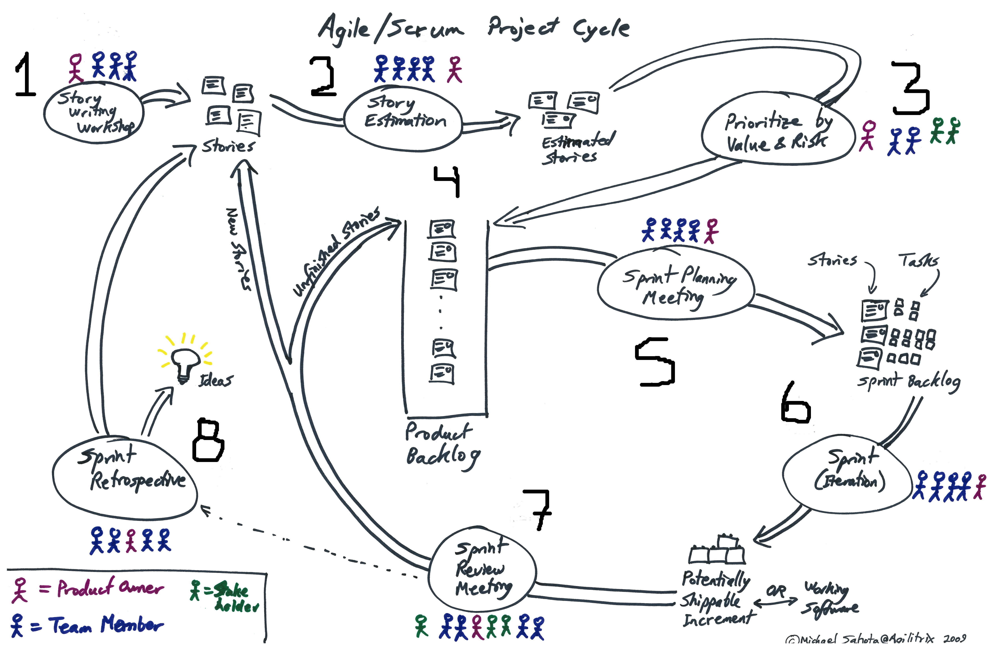

# Ciclo de vida de SCRUM

SCRUM es un marco de trabajo que nos ayuda a administrar un proyecto de desarrollo, brinda una base que ayuda a las empresas a administrar sus proyectos, no implica implementar cabios drasticos al modo de trabajo de la empresa, si no quepuede aplicar cambios poco a poco.

La siguiente imagen se puede observar una representacion grafica del ciclo de vida de SCRUM.

Los principales elementos de la metodología SCRUM son lo siguientes:

1. El Equipo Scrum 
 * El propietario del producto (Product Owner)
  * El Equipo de Desarrollo (Developers) 
 * El Scrum Master
2. Eventos de SCRUM 
 * La iteración (Sprint). El Sprint es el periodo de tiempo en el cual los desarrolladores trabajan sobre las historias de usuario y las tareas. Las cuales se comprometieron a terminar para la “Revisión del Sprint”. Estás HU son las representadas en el “Product Backlog”
 * Planificación de la iteración (Sprint Planning). Se realiza una junta en la cual se seleccionan las historias de usuario que se va a comprometer el equipo de desarrollo a entregar en el Sprint planificado. Dependiendo de la productividad del equipo se puede especificar un número de historias a realizar por Sprint.
 * Reunión diaria de SCRUM (Daily Scrum). Scrum sugiere que se realice una reunión diaria no mayor a quince minutos y de pie (para que no se prolongue), en la cual participan todos los desarrolladores involucrados en el proyecto, y por turnos cada uno contesta tres preguntas:

* ¿En qué historia de usuario estoy trabajando? 
* ¿Qué voy a hacer hoy en esa o en otra historia de usuario?
* ¿Qué me lo podría impedir?

Uno de los fines de realizar esta reuniones diarias, es asegurar el avance en las historias de usuario, e identificar si algún desarrollador enfrenta un problema o una situación que no puede resolver, expresando esto frente a sus compañeros, alguno podría dar una sugerencia para resolverlo o incluso colaborar en la resolución del problema, impidiendo así que hubiera atrasos.

 * Revisión de la iteración (Sprint Review). Es una junta en la que participan todos los involucrados en el proyecto:  El propietario del producto (Product Owner), el equipo de desarrollo (Developers) y el Scrum Master, en esta junta se le muestra al propietario del producto los avances que se tuvieron en la selección de las historias de usuario, también las HU que no se alcanzaron a terminar y se explica el motivo. Esta junta también sirve para realizar el nuevo compromiso del siguiente Sprint.
Dependiendo de la empresa la fecha del Sprint puede ser semanal, cada dos semanas o cada 3 semanas, no se recomienda que sean de más de 4 semanas, ya que podría representar retraso en el desarrollo de las HU.

* Retrospectiva del Sprint (Sprint). Después de la junta del Sprint, se realiza una pequeña junta en la cual se discuten los nuevos requerimientos, los cambios (en caso de que existan) o lo que hay que eliminar o modificar en el avance entregado al cliente.

3. Artefactos de Scrum 
 * Product Backlog. Aquí se encuentran todas las historias de usuario con las que cuenta el proyecto.
 * Sprint Backlog. Se encuentran las HU que fueron seleccionadas para realizar en el periodo de 2 semanas (según el modo de trabajar de la empresa) y que serán mostradas al cliente.
 * Incremento 

4. Transparencia de Artefacto 
 * Definición de "Hecho” (Done)

Explicación del Ciclo:

A continuación se mencionan más a fondo las acciones que se llevan a cabo dentro del ciclo de vida de SCRUM, según la experiencia que se ha tenido en el estudio de este marco de trabajo:

1. Redacción de historias de usuario. 
2. Estimación de historias de usuario.
3. Priorización por valor y riesgo
4. Product backlog
5. Junta de planeación del Sprint
6. Sprint
7. Junta de revisión del Sprint
8. Retrospectiva del Sprint

En este [enlace][1] podras encontrar la guia oficial de SCRUM.

[1]: http://www.scrumguides.org/
