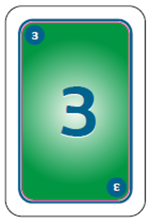

# Estimacion de Historias de usuario metodo: Planning poker

DUrante el ciclo de vida de Scrum es importante realizar la estimacion de las historias de usuario con el fin de estimar el total de periodo de tiempo que llevara terminar el proyecto.

La estimacion consiste en dar un valor a cada HU. Para ello en Scrum se uliliza el metodo "Planning poker".

Planning poker son cartas de poker pero con la numeracion de la serie de fibo nacci, cada miembro del equipo de desarrollo cuenta con un juego de estas cartas.

__¿Como se lleva a cabo la estimacion de las HU?__

1. El Scrum master toma una de las HU y la lee en voz alta al equipo de desarrollo.

2. A la cuenta de 3 cada miembro toma sus tarjetas y escoge la puntuacion que cree que merece esa historia, todos levantan su tarjeta al mismo tiempo basandose en la complejidad de desarrollo y en la experiencia.

Se repiten estos dos pasos hasta que todas las HU sean estimadas.

__¿Porque cada miembro tiene sus propias tarjetas?__

Este metodo de estimacion pretende que cada uno de los integrantes expresen lo que piensan sobre el tiempo que llevara desarrollar la historia y no que un solo miembro (el extrovertido del equipo) tome la desicion de la estimacion de las HU. Por ejemplo: En la mayoria o en casi todos los equipos de trabajo podemos encontrar a un extrovertido que siempre toma las riendas de lo que se quiere expresar y los que son timidos y no les gusta expresar sus opiniones aunque no esten de acuerdo con las desiciones que se estan tomando y dejan que los que siempre hablan tomen las desiciones importantes.

Para evitar esto, la votacion sobre la estimacion de las historias se lleva a cabo mediante estas tarjetas y todos al mismo tiempo muestran su tarjeta, con ello se esta asegurando que cada miebro exprese lo que piensa.

Si existe mucha diferencia entre lo que escogio un miebro y lo que escogio otro, se discute el porque de su estimacion y se llega a un acuerdo.

Para llevar a cabo la estimacion mediante este metodo, existen varias versiones de las tarjetas, asi como aplicaciones para celular.

__¿Que valor darle a las historias de usuario?__

Cuando no se conoce bien esta metododologia Scrum, en cocaciones resulta dificil comenzar a estimar las HU ya que por lo generar la estimacion del tiempo de desarrollo esta basada en las horas que los desarrolladores tardarian en realizar un caso de uno, por ejemplo si se utilizara PSP, la estimacion seria en un Dashboard y los desarrolladores tendria que registrar el tiempo que se esta trabajando, la hora a la que se toma un descanso etc.

En Scrum esto se realiza un poco mas sencillo ya que se estima por esfuerzo. Por ejemplo:

* El cero representa una historia que no se ha realizado previamente y es dificil de calcular que tan complejo seria realizarla.

* El 1/2 seria una historia demasiado sencilla, en la cual, no representa gran ezfuerzo.

* La carta con valor 3 segun la experiencia que tiene el facilitador de este curso, representaria una historia sencilla, como lo es un CRUD. Esta carta es la base para ir estableciendo que HU es mas compleja o menos compleja de desarrollar.

* El 100 se utilizaria para la estimacion de una historia bastate compleja, que llevara vario tiempo su realizacion.

* La carta con el signo de interrogacion ? se utiliza para una HU que no se ha realizado antes y que segun la experiencia de los desarrolladores, resulta demasiado complicada o que tal vez deberia ddebatirse para dividirla en historias mas pequeñas.

