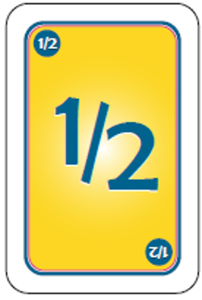

# Estimación de Historias de usuario método: Planning poker

Durante el ciclo de vida de Scrum es importante realizar la estimación de las historias de usuario con el fin de establecer el perísodo de tiempo que llevara terminar el proyecto.

La estimación consiste en dar un valor a cada HU. Para ello en Scrum se utiliza el método "Planning poker".

Planning poker son cartas de poker pero con la numeración de la serie de fibonacci, cada miembro del equipo de desarrollo cuenta con un juego de estas cartas.

__¿Como se lleva a cabo la estimación de las HU?__

1. El Scrum master toma una de las HU y la lee en voz alta al equipo de desarrollo.

2. A la cuenta de 3 cada miembro toma sus tarjetas y escoge la puntuación que cree que merece esa historia, todos levantan su tarjeta al mismo tiempo basandose en la complejidad de desarrollo y en su propia experiencia.

Se repiten estos dos pasos hasta que todas las HU sean estimadas.

__¿Porqué cada miembro tiene sus propias tarjetas?__

Este método de estimación pretende que cada uno de los integrantes expresen lo que piensan sobre el tiempo que llevara desarrollar la historia y no que un solo miembro (el extrovertido del equipo) tome la decisión de la estimación de las HU. Por ejemplo: En la mayoria o en casi todos los equipos de trabajo podemos encontrar a un extrovertido que siempre toma las decisiones importantes en las juntas y los que son timidos y no les gusta expresar sus opiniones  acatan lo decidido aunque no esten de acuerdo.

Para evitar esto, la votación sobre la estimación de las historias se lleva a cabo mediante estas tarjetas y todos al mismo tiempo muestran su tarjeta, con ello se esta asegurando que cada miembro exprese lo que piensa.

Si existe mucha diferencia entre lo que escogio un miebro y lo que escogio otro, se discute el porque de su estimación y se llega a un acuerdo.

Para llevar a cabo la estimación mediante este método, existen varias versiones de las tarjetas, asi como aplicaciones para celular.

__¿Que valor darle a las historias de usuario?__

Cuando no se conoce bien esta metododología Scrum, en cocaciones resulta difícil comenzar a estimar las HU, ya que por lo generar la estimación del tiempo de desarrollo esta basada en las horas que los desarrolladores tardarian en realizar un caso de uso, por ejemplo si se utilizará PSP, la estimación seria en un Dashboard y los desarrolladores tendrían que registrar el tiempo que se esta trabajando, la hora a la que se toma un descanso etc.

En Scrum esto se realiza un poco mas sencillo ya que se estima por esfuerzo y no por horas. A continuación se describe el significado de las cartas de planning poker.

* El cero representa una historia que no se ha realizado previamente y es difícil de calcular que tan complejo seria realizarla.

* El 1/2 seria una historia demasiado sencilla, la cual, desarrollar no representa gran ezfuerzo.

* La carta con valor 3 según la experiencia que tiene el facilitador de este curso, representaria una historia sencilla, como lo es un CRUD. Esta carta es la base para ir estableciendo que HU es más compleja o menos compleja de desarrollar.

* El 100 se utilizaria para la estimación de una historia bastate compleja, que llevara vario tiempo su desarrollo.

* La carta con el signo de interrogación ? se utiliza para una HU que no se ha realizado antes y que según la experiencia de los desarrolladores, resulta demasiado complicada o que tal vez deberia debatirse para dividirla en historias mas pequeñas.

