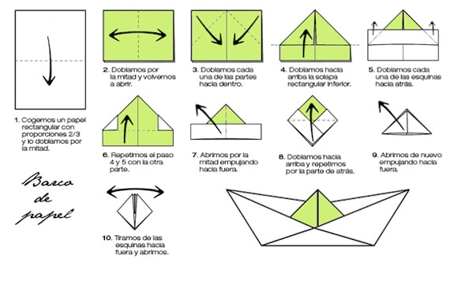

# Teoría de restricciones (TOC Theory of Constraints).

La teoría de restricciones escrita por Eliyahu M. Goldratt en su libro “Theory of Constraints”, describe que es una metodología sistemática de gestión y mejora de una empresa.

La meta de toda empresa es aumentar cada día más sus ganancias, pero, ¿Qué pasa cuando las ganancias no están aumentando?, la respuesta a esto son: “las restricciones” éstas, le impiden a una empresa aumentar sus ganancias. Para mejorar estas restricciones se deben realizar los siguientes pasos del proceso de gestión y mejora:

1. Identificar las restricciones de la empresa.
2. Explotar estas restricciones.
3. Subordinar todo lo demás a la restricción anterior.
4. Elevar las restricciones de la empresa.
5. Volver al paso 1.

En muchos países y en diversas empresas sin importar el giro se ha aplicado esta teoría, identificando y aplicando la gestión adecuada de las restricciones que tiene la organización, en poco tiempo han conseguido mejoras significativas.

Algunos ejemplos de grandes organizaciones que aplican esta teoría se relatan en el libro: "The World of the Theory Of Constraints" de Victoria Mabin y Steven Balderstone. Aunque no todas las organizaciones acceden a mostrar sus resultados, algunos descritos en este libro destacan los siguientes:

* Reducción del 50% en el lead time.
* Mejora del 44% en el cumplimiento de las fechas de entrega.
* Reducción del 49% en los inventarios.
* Incremento del 63% en ventas (Throughput).
* Incremento del 40% en las utilidades netas.

Resulta importante mencionar que “Teoría de restricciones”  tiene soporte académico, se da como materia en algunas de las especialidades como Ingeniería industrial.

Para comprender mejor como identificar una restriccion, observar el siguiente [video][1].

[1]: 

__Ejercicio: "Juego de los barcos de papel"__ 
Para lograr la mayor comprensión sobre el tema de “Teoría de restricciones” se realizará la siguiente actividad.

Este juego consiste en realizar barcos de papel, para ello se tendrán monedas con las cuales se va a comprar la materia prima (hojas de papel) que tendrán un valor de 2 monedas. Los participantes del curso crearán líneas de producción (equipos) de 5 personas.

Asignación de roles:

* __Dos analista de requerimientos.__ Es la persona que se encarga de comprar la materia prima, decide cuando es necesario comprar más materia prima. Realiza el paso 1 de la imagen.
* __Un desarrollador.__ del paso 2 al 10 de la imagen.
* __Una persona de diseño.__ Dibuja una ancla del lado derecho y una flor del lado izquierdo. Como se muestra en la figura.

* __Una persona con el rol de Tester.__ verifica que el barco esté correctamente doblado y que los dibujos coinciden con los indicados.

Pasos para realizar un barco de papel:

En este caso el cliente será uno de los instructores y el otro será el proveedor de materia prima.

Este juego se realiza 3 veces.

1. Por lotes.
2. 
3.
 
Al finalizar la tercera ronda se realiza una retroalimentación sobre el “juego de los barcos” y explicación de la teoría de restricciones (Tema).

Presentación de libros de David J. Anderson: Kanban: Successful Evolutionary Change for Your Technology Business.

