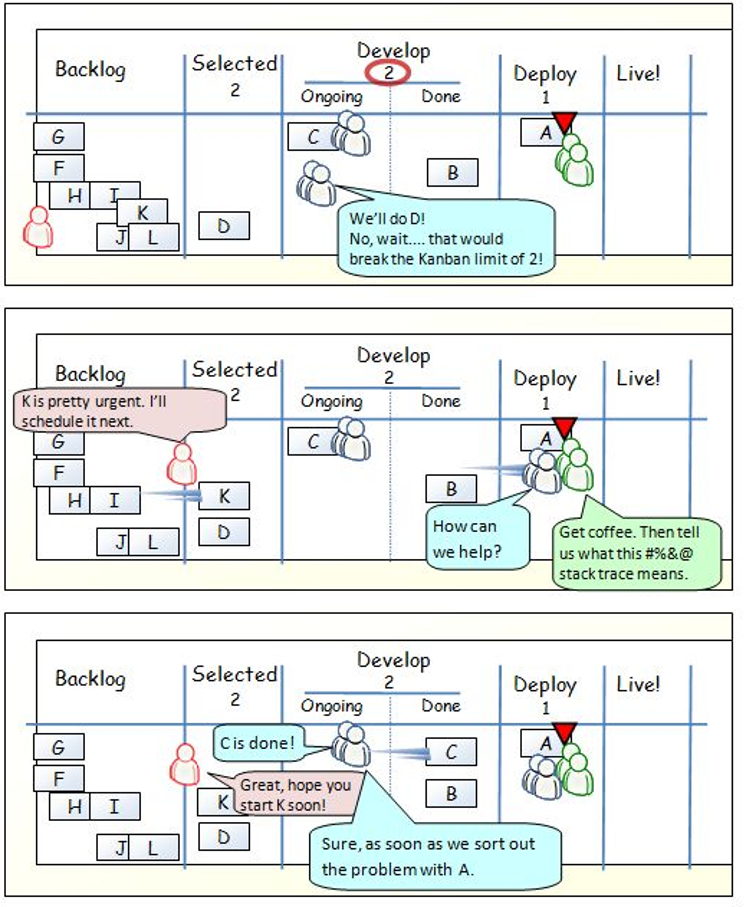

# 5.Kanban

Kanban es un método de producción, el cual consiste en dividir un proceso en fases delimitadas, proporcionando un mejor flujo de trabajo ideado por David J. Anderson.  Este método se aplicó en el desarrollo de software para crear productos con mejor calidad por primera vez en Microsoft, y desde entonces se ha aplicado en muchos proyectos en todo el mundo.
Kanban del japonés Kan que significa “Visual” y ban “Tarjeta”, este método es utilizado por Toyota el fabricante japonés de automóviles, en el cual divide el proceso de producción en fases bien delimitadas que se tenían que cubrir correctamente para poder pasar a la siguiente fase y cumplir con un producto de calidad.
Para mejor comprensión se muestra la siguiente figura la cual es un ejemplo del funcionamiento del Método Kanban en un equipo de desarrollo de Software, pero puede ser modificado y adaptado a cualquier proyecto que se esté manejando dependiendo de la forma de trabajo de cada organización.

__Principios de Kanban:__

1. Visualiza tu trabajo.
2. Limitar el trabajo.
3. gestionar el flujo.
4. Determinar las politicas del proceso.

__Ejemplo del funcionamiento de Kanban__

__Implementacion de Kanban__

Kamban puede ser implementado desde un pizarron fisico, en pared, en vidrios que dividen oficinas, con tarjetas aderibles, y divisiones con cianta, o con marcador, pero existen herrmanientas que ayudan a la generación del tablero como las siguientes:

__* Trello__

__* Kanban tools__

__* JIRA Greenhopper__

__* Cardmapping__

__* Targetprocess__

Después de la impartición de este curso, algunos de los asistentes han implementado Kanban en su trabajo para la administración de las tareas.

Ejemplos reales de tableros Kanban.

