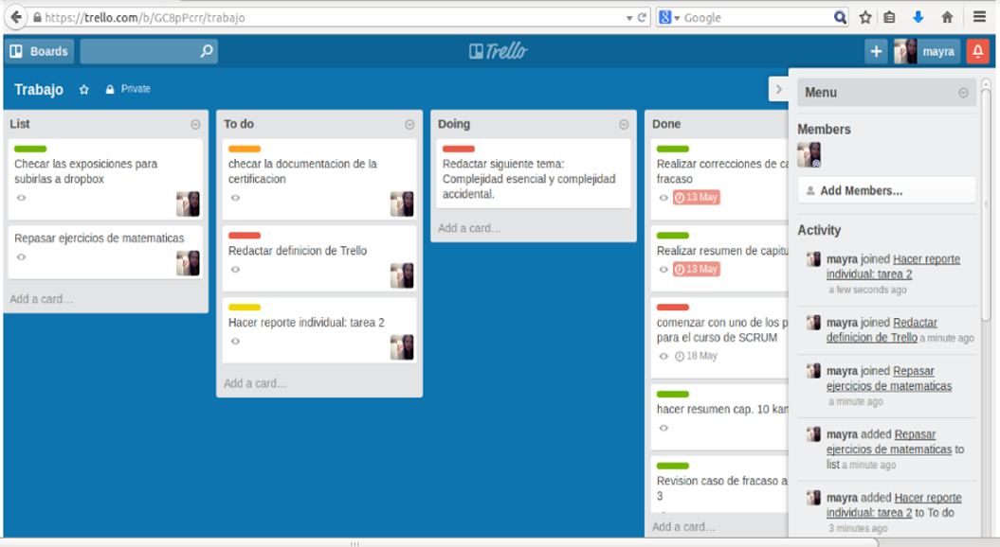

# Uso de la herramienta Trello para la gestion de actividades

Es un gestor de tareas el cual permite el trabajo en forma colaborativa mediante tableros, conformados por columnas que representan distintos estados.
Esta herramienta se basa en el método KANBAN para la gestión de proyectos, representando tarjetas que viajan por diferentes listas en función de su estado.
Recientemente ha implementado la integración de Google Drive y Dorpbox para traer archivos, documentos, o imágenes que se tenga en la nube.

__¿Cómo funciona?__

* El proyecto es representado por un tablero.
* El tablero contiene listas de tareas.
* Las tareas están descritas en tarjetas.

En la siguiente imagen se muestra como se puede utilizar trello para la gestión de tareas con las que cuenta un alumno. En la primera columna __“List”__ se describe en una tarjeta las actividades que se deben hacer, en __“To do”__ las tareas seleccionadas para esta semana, en la cual tenemos un límite de tres tareas o actividades por semana, en __“Doing”__ la tarea o actividad que estamos realizando en ese momento, y en la columna __“Done”__ tenemos las tareas que ya están terminadas.

A este tablero podemos agregar las columnas que sean necesarias o por las cuales debe de cumplir una tarea antes de ser colocada en la columna __“Done”__, por ejemplo: podemos agregarle una columna que se llame __“Review”__ en la cual la tarea quedaría a la espera de la revisión (tarea asignada a otra persona) antes de pasarla a terminado, con ello aseguramos que esté correcta, antes de pasarla a __“Done”__.

__Ejercicio:__ Cada uno de los asistentes al curso realizará su Kanban personal con el fin de familiarizarse a la herramienta  “Trello” y comenzar a gestionar las tareas o actividades que debe hacer, asi tendra un mejor control y podrá realizar una priorización de las tareas, pondrá en las fichas las actividades que tenga por realizar, y cosas que esté realizando en este momento en su vida personal.

Formar equipos de dos o tres personas para crear un Kanban de un proyecto que tengan en común.
Cada equipo presenta sus tableros.
